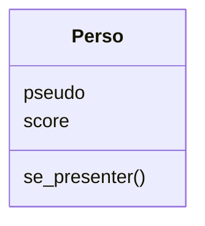

# Création d'une classe `Perso`

Nous voudrions créer une classe de personnages très simple pour un jeu vidéo selon le schéma suivant :



On voudrait que chaque personnage ait trois ***attributs*** :

- `pseudo` de type `str` : le pseudonyme du personnage, à définir à la création ;
- `score` de type `int` (nombre entier) : le score du personnage, égal à zéro à la création.

Chaque personnage a également une méthode `se_presenter()` : c'est une fonction qui renvoie un texte de présentation du personnage.

Nous allons créer et compléter la classe peu à peu dans l'IDE ci-dessous. Lisez attentivement le texte et recopiez les exemples de code dans l'IDE. Évitez les copier-coller !

{{IDE()}}

.


Tapez le code suivant puis exécutez le programme.

```py
class Perso:
    def __init__(self):
        self.score = 0
```

En apparence, il ne s'est rien passé, mais on a créé une classe ```Perso```.

!!! important

    On crée une classe avec le mot-clé Python ```class``` suivi du nom de la classe et d'un deux-points. Par convention, le nom d'une classe commence par une majuscule alors que les noms de variables sont en minuscules. 

    Dans la classe, avec la syntaxe habituelle des fonctions, on créé des méthodes. Ici a été créée la méthode ```__init__``` (avec deux tirets bas de chaque côté) et un paramètre ```self```.

Exécutez les instructions suivantes dans la console :

```py
moi = Perso()
print(moi.score)
```

Nous venons de créer un *objet* de la *classe* ```Perso```. 

!!! important
    Lors de la création d'un objet, Python appelle toujours la fonction ```__init__```. Le mot-clé ```self```, qui veut-dire "soi-même" en anglais, fait référence à l'objet qui est créé. Ici, lors de la création d'un ```Perso```, on attribue automatiquement la valeur 0 à son attribut ```score```.

La création d'un objet fait appel à une fonction, il est possible d'ajouter de multiples instructions dans cette fonction constructeur, comme dans n'importe quelle fonction Python. Par exemple, prévenons que la création s'est bien passée. Remplacez le code de l'éditeur par celui-ci et exécutez-le :

```py
class Perso:
    def __init__(self):
        self.score = 0
        print("Perso créé.")
moi = Perso()
```

On peut lire ou modifier un attribut d'un objet avec la syntaxe "point" ```nom_objet.nom_attribut```, ici ```moi.score```. Essayez :

```py
moi.score = 12
print(moi.score)
```

Il est possible de forcer le passage de paramètres à la création de l'objet. Par exemple, pour rendre obligatoire de donner un pseudo lorsqu'on crée un Perso :

``` py
class Perso:
    def __init__(self,pseudo):
        self.score = 0
        self.pseudo = pseudo
        print("Perso",self.pseudo,"créé")
moi = Perso("Mimi")
```

!!! important
    Tous les objets d'une même classe partagent des fonctions, communes, appelés **méthodes**. On définit une méthode comme toute fonction, mais son premier paramètre doit être le mot-clé ```self```, qui fait référence à l'objet lui-même.


Créons maintenant notre première méthode : `se_presenter`.

```py
class Perso:
    def __init__(self,pseudo):
        self.score = 0
        self.pseudo = pseudo
    
    def se_presenter(self):
        return "Bonjour, je m'appelle "+self.pseudo+" !"

toi = Perso("Momo")
pres = toi.se_presenter()
print(pres)
```

!!! important

    Quand on *exécute* une méthode d'un objet, il ne faut pas inclure le mot-clé ```self```, celui-ci sert uniquement à pouvoir utiliser le point pour appeler la fonction, et accéder à d'autres attributs ou méthodes. Par contre il est obligatoire en premier lors de la *définition* de la méthode dans la classe.

Dans notre exemple, la méthode `se_presenter` utilise `self.pseudo`. Le mot-clé `self` permet de dire à l'objet python "utilise le `pseudo` de toi-même", pas celui d'un autre.